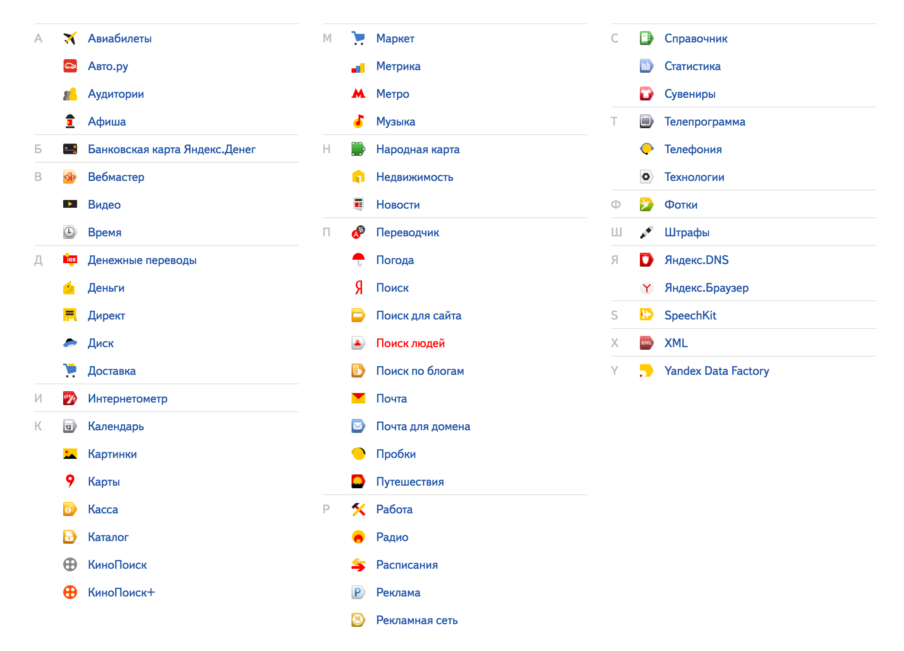
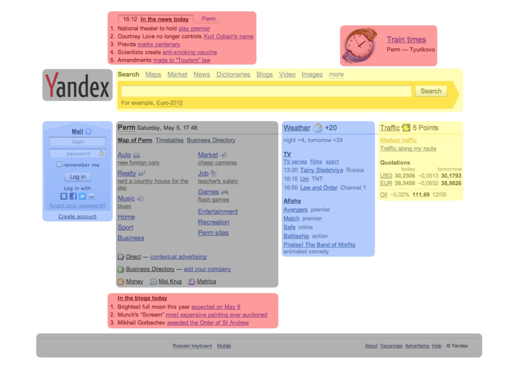
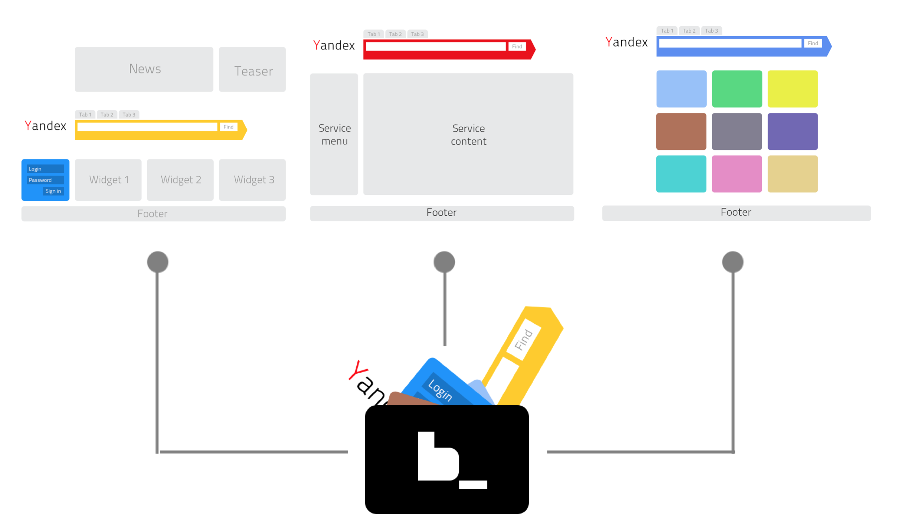
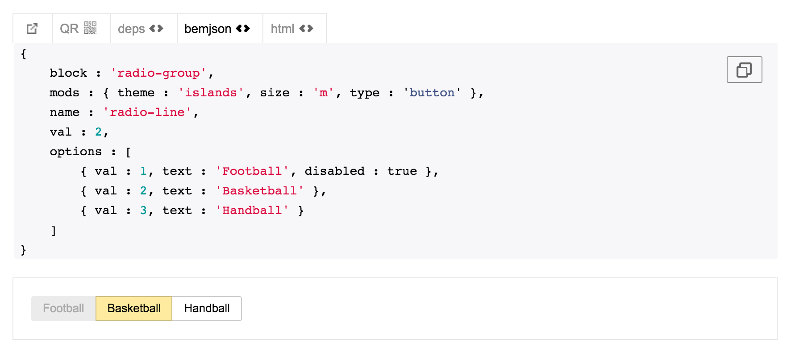
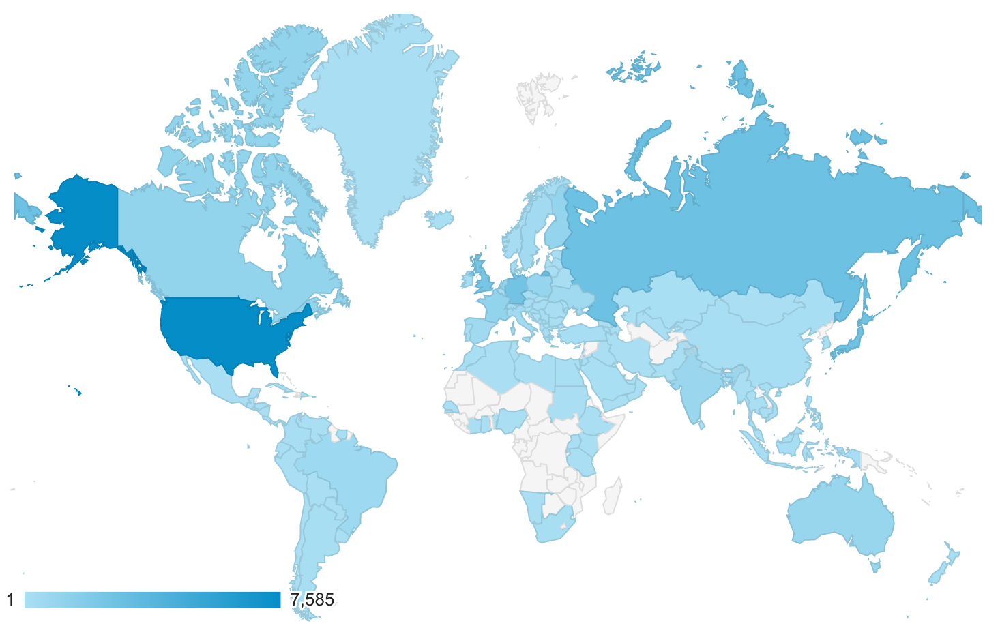

---

layout: sc5

style: |

    .slide h3 {
        font-size: 30px;
        font-weight: bold;
    }

    #Cover .main-logo__wrapper {
        width: 100%;
        text-align: center;
    }
    #Cover object.main-logo {
        z-index: 5;
        position: static;
        width: 200px;
        margin: 35px 50px;
    }

    #Cover h2 {
        margin:80px 0 0;
        color:#FFF;
        text-align:center;
        font-size:60px;
        line-height: 1.5em;
        }
    #Cover p {
        margin:10px 0 0;
        text-align:center;
        color:#FFF;
        font-size:20px;
        }
        #Cover p a {
            color:#FFF;
            }
    #Picture h2 {
        color:#FFF;
        }
    #SeeMore h2 {
        font-size:100px
        }
    #SeeMore img {
        width:0.72em;
        height:0.72em;
        }
    body {
      font-family: 'PT Sans', sans-serif;
      font-size: 24px;
    }
    .slide h2 {
      font-size: 52px; /* for cyrilic */
    }
    .slide>div {
      font-size: 32px;
      padding-top: 50px;
    }
    .slide ol li,
    .slide ul li {
      text-indent: -1em;
    }
    .slide pre {
        background-color: #efefef;
        padding: 15px;
    }
    .slide pre code {
        line-height: 1.5em;
        font-size: 26px;
    }
    .slide pre code:before {
        content: "";
    }
    .shout.slide {
      background-color: #ef4942;
    }
    .shout.slide h2 {
      color: #fff;
    }
    .statement.slide div {
      position: absolute;
      top: 50%;
      left: 50%;
      text-align: center;
      font-size: 75px;
      width: 100%;
      transform: translateY(-50%) translateX(-50%);
      line-height: 1.4em;
      font: 72px/1.2 'Gotham Rounded Medium','PT Sans',sans-serif;
    }
    .no-title h2 {
      display: none;
    }
    .slide.cover div {
      padding-top: 0;
      height: 640px;
    }
    img.cover {
      width: 100%;
      height: 100%;
    }
---

# Pattern libraries through trial and error {#Cover}

<div class="main-logo__wrapper">
    <object class="main-logo" data="themes/sc5/images/logo.min.svg#white" type="image/svg+xml"></object>
</div>

*Brought to you by&nbsp;[Varya&nbsp;Stepanova](http://varya.me/) from [SC5](http://sc5.io), 26th October 2016*
{: .credits }

<!--
This story sums up my experience in developing modular web solutions and pattern libraries. In fact, I am now doing
exactly the same what I was doing 8 years ago. But how I do it is very different from how I did it back then. And the
reasoning of choices for methods and tools to apply goes directly from grasping human nature, no less. BEM, living
styleguides and visual regression tests are involved.
-->

<style>

#Cover {
  background-image:url('pictures/fantacy-library.jpg');
  background-size: cover;
  background-position: 0 0, center;
}

#Cover h2 {
  text-shadow: 7px 3px 7px rgba(0,0,0,0.5);
  font-size: 48px;
  margin-top: 220px;
}

#Cover .credits {
    margin-top: 105px;
}
#Cover .credits,
#Cover .credits a {
  font-size: 20px;
  color: #fff;
  font-family: 'Lora',sans-serif;
  font-style: italic;
  text-shadow:
    3px 2px 3px rgba(0,0,0,0.5),
    -3px 2px 3px rgba(0,0,0,0.5),
    10px -2px 17px rgba(0,0,0,0.9);
}
</style>

## Bonjour!
{: .shout }

## Me
{: .no-title }

### Now
Senior Software Specialist at <b>SC5</b> (Helsinki)

### Before
<b>TMG</b> (Amsterdam, the Netherlands); <b>Yandex</b>&nbsp;(Moscow,&nbsp;Russia)

### Area of expertise
Components on the web: libraries, SGDD, BEM. Techs: CSS, JavaScript, etc

## Dreams

Developing is good but I want something more.

Do smth for not doing anything.

## Blocks
{: #blocks }

* Unified interface<br/>
  = stable result
* Code reusing<br/>
  = less work to do

<style>
#blocks {
  background-image:url(pictures/lego.jpg);
  background-size: cover;
  background-position: 0 0, center;

  color: #FFF;
}
#blocks.slide h2 {
  text-align: left;
  color: #FFF;
}
</style>

## Yandex
{: .shout }

## Yandex
{: .cover .no-title }

{: .cover }

## Over 200 sites & apps

{: .cover }

## The blocks
{: #the-blocks }

{: .cover }

<style>
#the-blocks h2 {
  margin-bottom: 0.25em;
}
</style>

## Lego
{: #lego }

{: .cover }

<style>
#lego h2 {
  margin-bottom: 0;
}
</style>

## The key ideas

### BEM

[bem.info](https://en.bem.info/), [getbem.com](http://getbem.com/)

### Multilingualism

```
  Dropdown/
    Dropdown.css
    Dropdowm.js
    Dropdown.md   // <-- NOTE! Documentation :-)
```

## Version migration
{: .shout }

## Version migration

Twitter bootsrap

* Rename classes
* Change HTML
* Fix JavaScript

1 website, 20 basic components

## Requirements

* Update 150+ websites
* 100+ common components, + custom components
* Do it yesterday
* Keep the people calm

## BEM tree
{: #bem-tree }

<table class="table"><tr>

<th>Stable abstract tree</th>
<th>HTML representation</th>

</tr><tr>

<td markdown="1" width="50%">

* page
  * header
    * logo
    * search
  * sidebar
    * menu
  * main
    

</td>
<td markdown="1" width="50%">

```
<div class="page">
  <div class="header">
    <div class="header__logo">
      <logo class="logo"></logo>
    </div>
    <div class="header__middle">
      <form class="search">
        <span class="search__input">
          <label class="input__hint input__hint--size--s"></label>
          <span class="input__box">
            <input class="input__control"/>
          </span>
        </span>
        <span class="search__button>
          <button role="button" class="button">
            Search
          </button>
        </span>
      </form>
    </div>
  </div>
  ...
</div>
```
{: .code }

</td>

</tr></table>

<style>
#bem-tree .table {
  table-layout: fixed;
}

#bem-tree ul {
  line-height: 1.25em;
}
#bem-tree li::before {
  content: "\021AA";
  color: grey;
}

#bem-tree .code {
  overflow: hidden;
}
#bem-tree .code code {
  font-size: 0.5em;
}
</style>

## Templates
{: #templates }

<table class="table"><tr>

<th>BEM tree</th>
<th width="25%"></th>
<th width="25%">HTML</th>

</tr><tr>

<td markdown="1" width="50%">

```
{
  block: "page",
  content: [
    {
      block: "header",
      content: [
        { block: "logo", title: "Custom alt title" },
        { block: "search" }
      ]
    },
    {
      block: "sidebar",
      content: ...
    },
    {
      block: "main",
      content: ...
    }
  ]
}
```
{: .code }
    

</td>
<td markdown="1" width="25%" class="templates">
</td>
<td markdown="1" width="25%">

```
<div class="page">
  <div class="header">
    <div class="header__logo">
      <logo class="logo"></logo>
    </div>
    <div class="header__middle">
      <form class="search">
        <span class="search__input">
          <label class="input__hint input__hint--size--s"></label>
          <span class="input__box">
            <input class="input__control"/>
          </span>
        </span>
        <span class="search__button>
          <button role="button" class="button">
            Search
          </button>
        </span>
      </form>
    </div>
  </div>
  ...
</div>
```
{: .code }

</td>

</tr></table>

<style>
#templates .table {
  table-layout: fixed;
}

#templates .code {
  overflow: hidden;
}
#templates .code code {
  font-size: 0.5em;
}

#templates .templates {
  background-image:url(pictures/gears.jpg);
  background-size: contain;
  background-position: 0 25%, center;
}
</style>

## Upgrade-button
{: .cover .no-title }

{: .cover }

## Pattern library
{: #pattern-library }

<div class="site">
  <div class="header">cross-company</div>
  <div class="pattern">
    <div class="example"></div>
    <div class="doc"></div>
  </div>
  <div class="pattern pattern--big">
    <div class="example"></div>
    <div class="doc"></div>
  </div>
  <div class="pattern pattern--big">
    <div class="example"></div>
    <div class="doc"></div>
  </div>
</div>

<div class="site site--specific">
  <div class="header">service specific</div>
  <div class="pattern">
    <div class="example"></div>
    <div class="doc"></div>
  </div>
  <div class="pattern pattern--big">
    <div class="example"></div>
    <div class="doc"></div>
  </div>
  <div class="pattern pattern--big">
    <div class="example"></div>
    <div class="doc"></div>
  </div>
</div>

<style>
#pattern-library.slide > div {
  position: relative;
}

#pattern-library .site {
  top: 150px;
  left: 150px;
  font-size: 20px;
  background-color: #FFF;
  position: absolute;
  width: 15em;
  height: 10em;
  border: grey 5px solid;
  border-radius: 5px;
  overflow: hidden;
  text-align: center;
  line-height: 1.5em;
}
#pattern-library .site .header {
  width: calc(100% - 20px);
  height: 2em;
  background-color: lightgrey;
  margin: 0.5em;
}

#pattern-library .site .pattern {
  margin: 0 0.5em;
}
#pattern-library .site .example {
  display: inline-block;
  width: 2.5em;
  height: 1.25em;
  background-color: lightgreen;
}
#pattern-library .site .doc {
  display: inline-block;
  width: calc(100% - 2.95em);
  height: 1.25em;
  position: relative;
  background-image: url("data:image/svg+xml,%3Csvg width='100' height='20' viewBox='0 0 100 20' xmlns='http://www.w3.org/2000/svg'%3E%3Cpath d='M21.184 20c.357-.13.72-.264 1.088-.402l1.768-.661C33.64 15.347 39.647 14 50 14c10.271 0 15.362 1.222 24.629 4.928.955.383 1.869.74 2.75 1.072h6.225c-2.51-.73-5.139-1.691-8.233-2.928C65.888 13.278 60.562 12 50 12c-10.626 0-16.855 1.397-26.66 5.063l-1.767.662c-2.475.923-4.66 1.674-6.724 2.275h6.335zm0-20C13.258 2.892 8.077 4 0 4V2c5.744 0 9.951-.574 14.85-2h6.334zM77.38 0C85.239 2.966 90.502 4 100 4V2c-6.842 0-11.386-.542-16.396-2h-6.225zM0 14c8.44 0 13.718-1.21 22.272-4.402l1.768-.661C33.64 5.347 39.647 4 50 4c10.271 0 15.362 1.222 24.629 4.928C84.112 12.722 89.438 14 100 14v-2c-10.271 0-15.362-1.222-24.629-4.928C65.888 3.278 60.562 2 50 2 39.374 2 33.145 3.397 23.34 7.063l-1.767.662C13.223 10.84 8.163 12 0 12v2z' fill='%23c3c3c3' fill-opacity='0.4' fill-rule='evenodd'/%3E%3C/svg%3E");
}
#pattern-library .site .pattern--big .example {
  height: 2.25em;
  background-color: lightblue;
}
#pattern-library .site .pattern--big .doc {
  height: 2.25em;
}

#pattern-library .site--specific {
  top: 250px;
  left: 350px;
  font-size: 30px;
}
</style>


## BEM eco system
{: .shout }

## BEM eco system

* Methodology
* File structure
* Building tools
* Libraries: bem-core, [bem-components](https://en.bem.info/libs/bem-components/v3.0), bem-mvc, ...

## BEM(ish) style guide
{: #bem-components }

{: .pic }

<style>
#bem-components .pic {
  width: 100%;
}
</style>

## To repeat it
{: #to-repeat }

* Understand the theory
* Follow the structure
* [Copy and modify the config](examples/config.js)
* <b>Programm different</b>

<style>
#to-repeat .code {
  width: 100%;
  height: 300px;
  font-size: 9px;
}
</style>

## SC5
{: .shout }

## Going over the test
{: .statement .no-title #over-test }

Going over the test

<style>
#over-test > div p {
  line-height: 400px;
}
</style>

## Human's problems
{: .no-title .statement #problems }

Do not solve technical problems.
{: .not }

Help people!
{: .help }

<style>
#problems .not {
  font-family: 'Lora',sans-serif;
}
#problems .help {
  text-transform: uppercase;
  font-size: 96px;
  color: #31727d;
}
</style>

## Think modularly
{: .shout }

## Living styleguides

* code-generated examples
* live updates
* component-focused development<br/>
  = "styleguide first"

## SC5 Styleguide

## Version migration?
{: .shout }

<!-- How about version migration again? -->

## Workaround

### Problem?
Something is broken.

<div class="next" markdown="1">
### Problem?
<b>Something</b> is broken. I do not know <b>what</b> and <b>where</b>.
</div>

## Visual tests

More slides

## Client projects

* Elisa
* DNA
* Veikkaus
* Small projects

## Open<br/>source
{: .shout }

## Open source

* Start in open source
* Feature is more than code
* Enjoy the community

## Community
{: .shout }

## World
{: .no-title #world }

{: .world }

<style>
#world .world {
  width: 95%;
}
</style>

## Thank you
{: .thanks }

Varya Stepanova<br/>
[@varya_en](https://twitter.com/varya_en){: .twitter }

### Slides: [varya.me/dotcss-2016](http://varya.me/dotcss-2016/)

<style>
.thanks h3 {
  font-size: 38px;
  margin-bottom: 0.5em;
}
.thanks .twitter
{
  text-decoration: none;
  color: currentColor;
  background: none;
}
.thanks .twitter::before
{
  content: "";
  display: inline-block;
  width: 1.5em;
  height: 1.5em;
  background-image:url('pictures/twitter-logo.png');
  background-size: cover;
  margin-right: 0.5em;
  margin-bottom: -0.5em;
}
</style>
